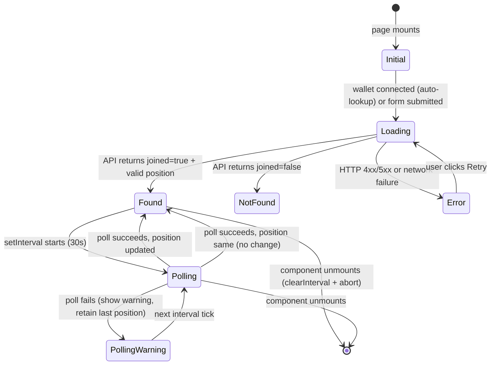

# Design Document: Waitlist Status Page

## Overview

The Waitlist Status Page (`/waitlist/status`) is a dedicated frontend page that lets users check their current position in the stellAIverse premium access queue. It supports two lookup mechanisms — connected Stellar wallet (auto-triggered on mount) and email address (manual form) — and displays position, ETA, and join date wrapped in the project's cosmic UI aesthetic. The page polls for position updates every 30 seconds while the user is actively watching their position.

This feature extends the existing `/app/waitlist/` directory and consumes the already-live `GET /api/waitlist` endpoint. It introduces a custom hook (`useWaitlistStatus`) that encapsulates all fetch logic, polling, and cleanup, and a set of focused presentational components under `components/waitlist/`.

### Key Design Goals

- **No new dependencies**: reuse `Card`, `Button`, `useStellarWallet()`, Tailwind, and the existing API.
- **Clean separation**: all stateful logic lives in `useWaitlistStatus`; components are thin renderers.
- **Correctness-first ETA**: `calculateEta` is a pure function — easy to test and reason about.
- **Accessible by default**: `aria-label` attributes are co-located with the data they describe; focus order follows DOM order.

---

## Architecture

The feature follows a layered structure:

```
Server Component (page.tsx)
  └── WaitlistStatusView (Client Component, 'use client')
        ├── useWaitlistStatus (hook — owns all async/polling state)
        ├── StatusSkeleton      (loading state)
        ├── StatusError         (error state with Retry)
        ├── LookupForm          (email input form)
        └── PositionCard        (found state — position, ETA, join date)
```

`page.tsx` is a minimal Next.js 14 App Router Server Component. It renders no interactive logic — its sole job is to import and mount `WaitlistStatusView`, providing the page title and metadata. This keeps the bundle split clean and lets Next.js pre-render the shell.

All client-side state lives in `WaitlistStatusView` via the `useWaitlistStatus` hook. Child components receive only the data they need to render — no prop drilling of setters or callbacks beyond what is listed in the interfaces below.

### State Machine



---

## Components and Interfaces

### `app/waitlist/status/page.tsx`

Server Component shell. Exports page metadata and renders `WaitlistStatusView`.

```ts
// No props — Next.js page
export default function WaitlistStatusPage(): JSX.Element
```

**Metadata:**
```ts
export const metadata: Metadata = {
  title: 'Waitlist Status | stellAIverse',
  description: 'Check your position in the stellAIverse premium access queue.',
};
```

---

### `components/waitlist/WaitlistStatusView.tsx`

Top-level `'use client'` component. Reads `wallet` from `useStellarWallet()`, drives `useWaitlistStatus`, and conditionally renders one of: `StatusSkeleton`, `StatusError`, `LookupForm` (not-found or initial), or `PositionCard`.

```ts
interface WaitlistStatusViewProps {}  // no external props

// Internal render logic based on hook state:
// status === 'idle'        → LookupForm (wallet not connected)
// status === 'loading'     → StatusSkeleton
// status === 'found'       → PositionCard
// status === 'not_found'   → not-found message + /waitlist link
// status === 'error'       → StatusError
```

**Wallet auto-lookup rule**: On mount, if `wallet.publicKey` is present, the hook fires automatically. If that lookup returns `joined: false` or errors, `WaitlistStatusView` shows `LookupForm` without an error attribution.

**Polling badge**: When `isPolling === true`, renders a small `"Updating…"` badge in the page header area, outside `PositionCard`.

---

### `hooks/useWaitlistStatus.ts`

Custom hook. Single source of truth for async state.

```ts
type WaitlistUIStatus = 'idle' | 'loading' | 'found' | 'not_found' | 'error';

type ErrorKind = 'server' | 'client' | 'network' | 'invalid_position';

interface WaitlistState {
  status: WaitlistUIStatus;
  position: number | null;
  joinedAt: string | null;       // raw ISO string from API
  errorKind: ErrorKind | null;
  isPolling: boolean;            // true while a poll fetch is in-flight
  pollWarning: boolean;          // true after a failed poll (last known position shown)
  lastIdentifier: { type: 'email' | 'wallet'; value: string } | null;
}

interface UseWaitlistStatusReturn extends WaitlistState {
  lookup: (identifier: { type: 'email' | 'wallet'; value: string }) => void;
  retry: () => void;
}

export function useWaitlistStatus(): UseWaitlistStatusReturn
```

**Fetch logic:**
1. Build URL: `email` → `/api/waitlist?email=${encodeURIComponent(email)}`, `wallet` → `/api/waitlist?walletAddress=${walletPublicKey}`
2. Create `AbortController` per request.
3. On success (`joined: true`): validate `position` — if `null`, `undefined`, or not a positive integer, set `errorKind: 'invalid_position'`.
4. On `joined: false`: set `status: 'not_found'`.
5. On HTTP 5xx: set `errorKind: 'server'`.
6. On HTTP 4xx (non-404 handled above): set `errorKind: 'client'`.
7. On fetch rejection (network): set `errorKind: 'network'`.

**Polling logic:**
- Only start `setInterval` when `status === 'found'` and `position >= 1`.
- Interval: `30_000` ms.
- Poll uses the same `lastIdentifier` stored in state.
- On poll in-flight: set `isPolling: true`.
- On poll success with different position: update `position` + clear `pollWarning`.
- On poll success with same position: clear `isPolling` badge only.
- On poll failure: set `pollWarning: true`, retain `position`, clear `isPolling`.
- On unmount: `clearInterval(intervalRef.current)` + `abortControllerRef.current?.abort()`.

---

### `components/waitlist/PositionCard.tsx`

Displays position number, "Next in line" badge (when position === 1), ETA, and join date. All values come from props; no internal state.

```ts
interface PositionCardProps {
  position: number;
  joinedAt: string | null;  // raw ISO string; component handles formatting + absence
  pollWarning: boolean;
}
```

**ETA**: computed inline via `calculateEta(position)` — a pure function imported from a co-located utility.

**Aria attributes** (co-located with rendered elements):
- Position element: `aria-label={`Queue position: ${position}`}`
- ETA element: `aria-label={`Estimated wait time: ${etaString}`}`
- Join date element (when present): `aria-label={`Joined on: ${formattedDate}`}`

**"Next in line" badge**: rendered only when `position === 1`.

**Poll warning**: renders `"Could not refresh — showing last known position"` in a `<p>` below the card when `pollWarning === true`.

---

### `components/waitlist/LookupForm.tsx`

Email input form. Handles its own local validation state; calls `onSubmit` only when the email passes the regex.

```ts
interface LookupFormProps {
  onSubmit: (email: string) => void;
  isLoading: boolean;
}
```

**Validation**: inline, client-side via `/^[^\s@]+@[^\s@]+\.[^\s@]+$/`. Renders `"Please enter a valid email address"` adjacent to the input on failure. No API call is made on validation failure.

**Input attributes**: `type="email"`, `maxLength={254}`, `autoComplete="email"`, visible focus ring (`focus:ring-2 focus:ring-cosmic-purple/60`).

---

### `components/waitlist/StatusSkeleton.tsx`

Skeleton placeholders that match the approximate dimensions of `PositionCard` and its labels. No props.

```ts
export function StatusSkeleton(): JSX.Element
```

Uses `animate-pulse` with `bg-cosmic-purple/20 rounded` divs sized to match:
- Position number block: `h-14 w-24`
- ETA block: `h-5 w-40`
- Join date block: `h-5 w-32`
- Label blocks: `h-4 w-28`

---

### `components/waitlist/StatusError.tsx`

Error state with appropriate message and a Retry button.

```ts
interface StatusErrorProps {
  errorKind: 'server' | 'client' | 'network' | 'invalid_position';
  onRetry: () => void;
}
```

**Message mapping:**
| `errorKind`        | Message                                                       |
|--------------------|---------------------------------------------------------------|
| `server`           | "Something went wrong. Please try again."                    |
| `client`           | "Request failed. Please check your input and try again."     |
| `network`          | "Network error. Check your connection and try again."        |
| `invalid_position` | "Position data unavailable. Please try again."               |

---

## Data Models

### API Response Types

```ts
// GET /api/waitlist?email={email} or ?walletAddress={address}

type WaitlistFoundResponse = {
  joined: true;
  position: number;
  joinedAt: string;   // ISO 8601
};

type WaitlistNotFoundResponse = {
  joined: false;
  count: number;
};

type WaitlistApiResponse = WaitlistFoundResponse | WaitlistNotFoundResponse;
```

### ETA Utility

```ts
// lib/waitlist/calculateEta.ts  (pure function, no side effects)

export function calculateEta(position: number, throughputRate = 10): string {
  if (position <= 10) return 'Within 24 hours';
  const days = Math.ceil(position / throughputRate);
  if (days === 1) return '~1 day';
  if (days <= 6) return `~${days} days`;
  if (days <= 13) return '~1 week';
  if (days <= 27) return `~${Math.floor(days / 7)} weeks`;
  return `~${Math.floor(days / 30)} month(s)`;
}
```

Extracted to `lib/waitlist/calculateEta.ts` so it can be imported by both `PositionCard` and property-based tests without pulling in React.

### Join Date Formatter

```ts
// lib/waitlist/formatJoinDate.ts  (pure function)

export function formatJoinDate(isoString: string): string | null {
  const d = new Date(isoString);
  if (isNaN(d.getTime())) return null;
  return d.toLocaleDateString('en-US', { month: 'long', day: 'numeric', year: 'numeric' });
  // e.g., "June 12, 2025"
}
```

Returns `null` for unparseable strings — `PositionCard` omits the date element when `formatJoinDate` returns `null`.

---

## Correctness Properties

*A property is a characteristic or behavior that should hold true across all valid executions of a system — essentially, a formal statement about what the system should do. Properties serve as the bridge between human-readable specifications and machine-verifiable correctness guarantees.*

### Property 1: ETA bucketing is total and correct

*For any* positive integer `position` and positive integer `throughputRate`, `calculateEta(position, throughputRate)` SHALL return exactly one of the six defined ETA strings, and the string returned SHALL correspond to the correct bucket as determined by `days = Math.ceil(position / throughputRate)`.

**Validates: Requirements 2.1, 2.2**

---

### Property 2: ETA is "Within 24 hours" for all positions ≤ 10, regardless of throughput rate

*For any* integer `position` in `[1, 10]` and *any* positive integer `throughputRate`, `calculateEta(position, throughputRate)` SHALL return `"Within 24 hours"`.

**Validates: Requirements 2.3**

---

### Property 3: Email lookup URL is always correctly URI-encoded

*For any* string that passes the email validation regex `/^[^\s@]+@[^\s@]+\.[^\s@]+$/`, when `lookup({ type: 'email', value: email })` is called, the resulting fetch URL SHALL contain `email=` followed by `encodeURIComponent(email)` as a query parameter with no unencoded special characters.

**Validates: Requirements 3.4**

---

### Property 4: Invalid email strings are always rejected without an API call

*For any* string that does NOT match the email validation regex `/^[^\s@]+@[^\s@]+\.[^\s@]+$/`, submitting that string via `LookupForm` SHALL result in zero `fetch` calls and SHALL display the inline validation error "Please enter a valid email address".

**Validates: Requirements 3.5**

---

### Property 5: Polling correctly reflects any updated position

*For any* initial valid position `p1` and any subsequent poll response with position `p2` (where `p2 ≠ p1`), after the poll completes, the displayed position SHALL equal `p2` and the displayed ETA string SHALL equal `calculateEta(p2)`. When `p2 === p1`, the displayed position and ETA SHALL remain unchanged.

**Validates: Requirements 4.3, 4.4**

---

### Property 6: Retry always re-issues the request with the same identifier

*For any* identifier `{ type, value }` used in a failed Status_Lookup, activating the Retry button SHALL trigger a new fetch to the same URL (same query parameter name and value) as the original failed request, with no modification to the identifier.

**Validates: Requirements 5.4**

---

### Property 7: Join date formatting round-trip produces correct pattern

*For any* valid ISO 8601 date-time string `isoString`, `formatJoinDate(isoString)` SHALL return a string matching the pattern `{FullMonthName} {Day}, {Year}` (e.g., `"June 12, 2025"`), and parsing the returned string back to a Date SHALL yield a date with the same calendar day, month, and year as `new Date(isoString)`.

**Validates: Requirements 6.1**

---

### Property 8: Aria-labels include the rendered data value for all valid inputs

*For any* valid position integer `n`, the position display element SHALL have `aria-label` equal to `"Queue position: " + String(n)`; the ETA display element SHALL have `aria-label` equal to `"Estimated wait time: " + calculateEta(n)`; and when `joinedAt` is a valid ISO 8601 string, the join date element SHALL have `aria-label` equal to `"Joined on: " + formatJoinDate(joinedAt)`.

**Validates: Requirements 7.2, 7.3**

---

## Error Handling

### HTTP Error Discrimination

The hook discriminates error kinds at the fetch boundary so that error messages are accurate:

```
fetch response:
  ├── ok (2xx)          → parse JSON, check joined + validate position
  ├── 400–499           → errorKind: 'client'   (except 404 = not_found path via joined:false)
  ├── 500+              → errorKind: 'server'
  └── fetch rejects     → errorKind: 'network'

joined: true but position invalid → errorKind: 'invalid_position'
```

### Wallet Auto-Lookup Failure Handling

When the wallet auto-lookup fires on mount and fails for **any** reason (network, 4xx, 5xx, `joined: false`), the page silently falls back to showing `LookupForm`. No error state is set and no error message is attributed to the wallet lookup. This prevents the page from landing in an error state before the user has done anything.

### Poll Failure Handling

Poll failures are intentionally non-escalating. The page does **not** enter `status: 'error'` on a poll failure — only on the initial lookup. This is because the user already has a last-known position value which remains useful. The `pollWarning` flag surfaces a non-blocking informational message instead.

### AbortController Usage

Each call to `lookup()` creates a fresh `AbortController`. The ref `abortControllerRef` stores the current controller so that:
1. Unmount cleanly aborts any in-flight request.
2. Calling `retry()` or `lookup()` while a request is in-flight aborts the previous one first (prevents race conditions on rapid re-submission).

---

## Testing Strategy

### Unit Tests (example-based)

Focused on specific scenarios and edge cases where behavior is determined by a single concrete input:

- **`calculateEta`**: boundary values — position 1, 10, 11, 70, 100, 140, 280, 300 — and verify exact string output.
- **`formatJoinDate`**: valid ISO string → correct formatted string; `null`/`undefined`/garbage string → returns `null`.
- **`PositionCard`**: renders "Next in line" when position === 1; omits join date element when `joinedAt` is `null`.
- **`LookupForm`**: renders maxLength=254 attribute; shows validation error on empty string; shows validation error on clearly invalid format.
- **`StatusError`**: renders correct message for each `errorKind` variant.
- **`StatusSkeleton`**: renders skeleton placeholder elements.
- **`WaitlistStatusView` (integration)**: wallet connected → auto-lookup fires; wallet lookup fails → email form shown; API 500 → error state; API returns not-found → not-found state with /waitlist link; clicking Retry after error re-issues fetch.
- **Polling**: `setInterval` is called with 30_000ms; `clearInterval` + `abort()` are called on unmount; `pollWarning` state is set on poll failure.

### Property-Based Tests

Using **fast-check** (already compatible with Jest/Vitest). Each property runs a minimum of **100 iterations**.

Tag format: `Feature: waitlist-status-page, Property {N}: {property_text}`

| Property | PBT Approach |
|----------|-------------|
| **P1** — ETA bucketing | `fc.integer({ min: 1, max: 10_000 })` × `fc.integer({ min: 1, max: 100 })` → call `calculateEta`, assert return value is one of the 6 strings AND matches expected bucket formula |
| **P2** — ETA ≤ 10 invariant | `fc.integer({ min: 1, max: 10 })` × `fc.integer({ min: 1, max: 1000 })` → assert result === `"Within 24 hours"` |
| **P3** — Email URL encoding | `fc.emailAddress()` (fast-check built-in) → mock fetch, assert URL contains `email=${encodeURIComponent(email)}` |
| **P4** — Invalid email rejection | `fc.string()` filtered to NOT match email regex → render LookupForm, submit, assert no fetch called and error message present |
| **P5** — Polling position update | `fc.integer({ min: 1 })` × `fc.integer({ min: 1 })` → mount hook with p1, simulate poll returning p2, assert correct display behavior |
| **P6** — Retry identifier preservation | `fc.oneof(fc.emailAddress(), fc.string({ minLength: 56, maxLength: 56 }))` → trigger failure, click retry, assert same URL params |
| **P7** — Date format round-trip | `fc.date()` → convert to ISO string, call `formatJoinDate`, assert pattern match + calendar equivalence |
| **P8** — Aria-labels | `fc.integer({ min: 1, max: 10_000 })` × valid ISO date → render PositionCard, assert all three aria-labels match expected format |

### Accessibility Testing

Full WCAG 2.1 AA validation requires manual testing with assistive technologies and expert accessibility review. Automated checks (using `jest-axe` or `axe-core`) should be added to the `WaitlistStatusView` render test to catch obvious violations, but do not substitute for manual audit.

- Tab order: verified in `WaitlistStatusView` integration test by querying `document.activeElement` through sequential Tab presses.
- Contrast: manual audit against the cosmic design tokens (purple `#8B5CF6` on dark background `#0A0E27` achieves > 6:1 in dark mode).
